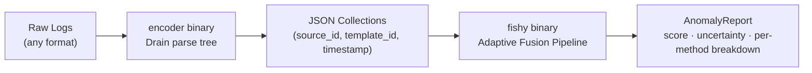
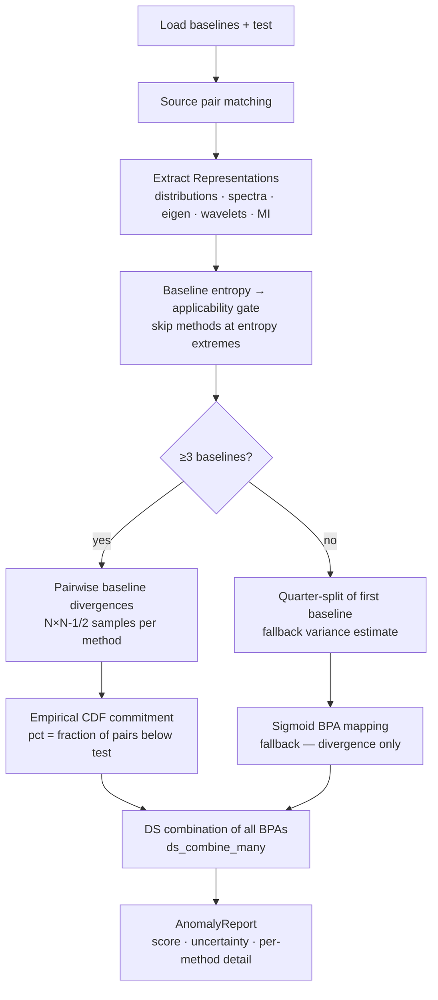

# Architecture — fishy

## System Overview

fishy is a **collection comparison** anomaly detector. Given two bounded log collections (baseline and test), it fuses evidence from six independent analysis methods via Dempster-Shafer theory into a single score + uncertainty.



## Crate Boundary

```mermaid
graph TB
    subgraph analysis["analysis crate (stateless math)"]
        A1[distributional_divergence]
        A2[mutual_information_matrix_timed]
        A3[spectral_fingerprint / wavelet_decompose]
        A4[co_occurrence_spectrum]
        A5[ds_combine_many]
        A6[bpa_from_zscore / evidence_bpa]
        A7[shannon_entropy / spectral_entropy / matrix_entropy]
    end
    subgraph fishy["fishy crate (orchestration)"]
        F1[detect\(\) entry point]
        F2[extract\(\) — Representations]
        F3[adaptive_inner\(\) — fusion pipeline]
        F4[pairwise_baseline_stats\(\)]
        F5[empirical_commitment\(\)]
        F6[reject_outlier_baselines\(\)]
        F7[trend_signals\(\)]
    end
    subgraph encoder["encoder crate (tokenization)"]
        E1[DrainTree — train / classify]
        E2[build_drain_tree\(\)]
        E3[build_dictionary\(\)]
        E4[encode\(\)]
    end
    fishy --> analysis
    encoder --> fishy
```

**Key constraint**: `analysis` never imports `fishy` types. It operates on `&[f64]`, `EventDistribution`, `MIMatrix`, etc. — not `LogCollection`.

## Adaptive Fusion Pipeline



## Multi-Baseline Scoring

With ≥3 baselines, the test is scored against its **nearest baseline** (min-divergence), not a fixed reference. This prevents startup-day drift from inflating scores when better baselines exist.

## On-Disk Format

Each collection is a directory:
```
collection/
├── meta.json          {"start_time": u64, "end_time": u64}
├── 0.json             {"events": [{"template_id": u32, "timestamp": u64, "params": {}}]}
├── 1.json
└── ...
```
