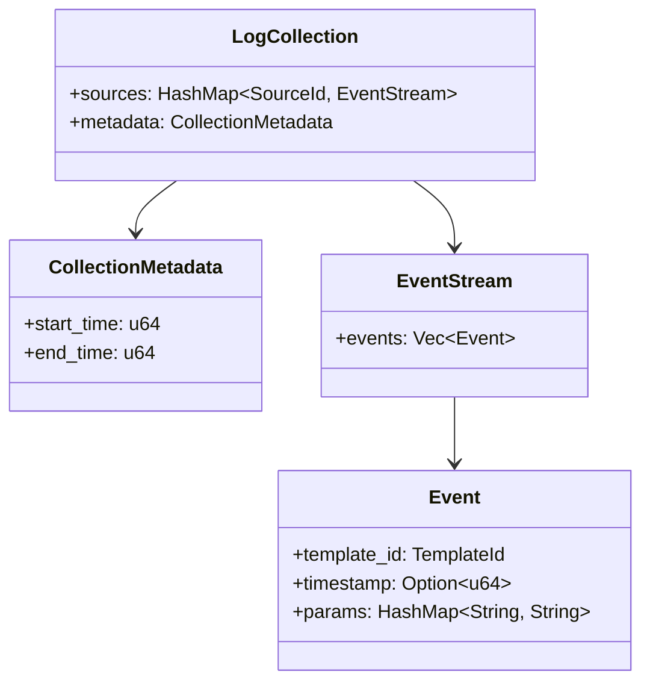
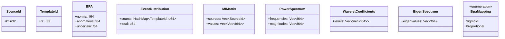
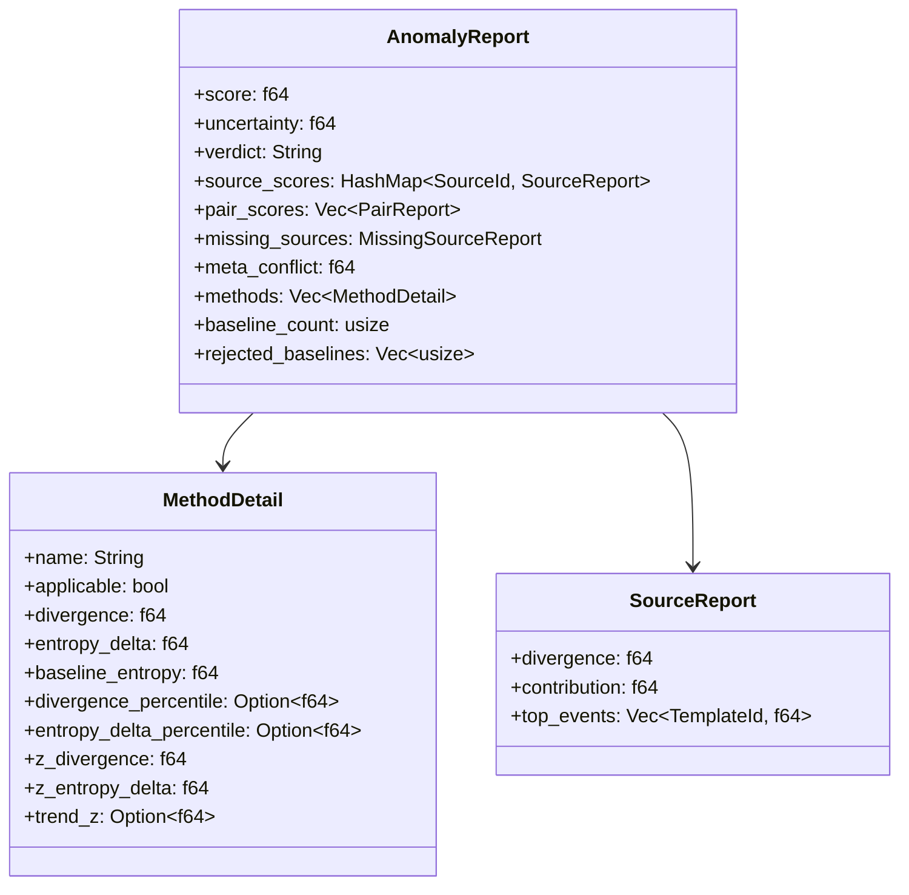

# Data Models — fishy

## Core domain types (fishy crate)



## Analysis types (analysis crate)



`SourceId(0)` and `TemplateId(0)` are reserved: `TemplateId(0)` = unknown template, `SourceId` values are assigned by sorted source name order.

## Output types



## On-disk JSON format

**meta.json**
```json
{"start_time": 1642118400, "end_time": 1642204800}
```

**`<source_id>.json`**
```json
{
  "events": [
    {"template_id": 42, "timestamp": 3600, "params": {}},
    {"template_id": 1,  "timestamp": 7200, "params": {}}
  ]
}
```

Timestamps are relative seconds from collection start (set by encoder) or absolute Unix seconds (set by prep scripts). fishy uses relative timestamps internally after loading.
