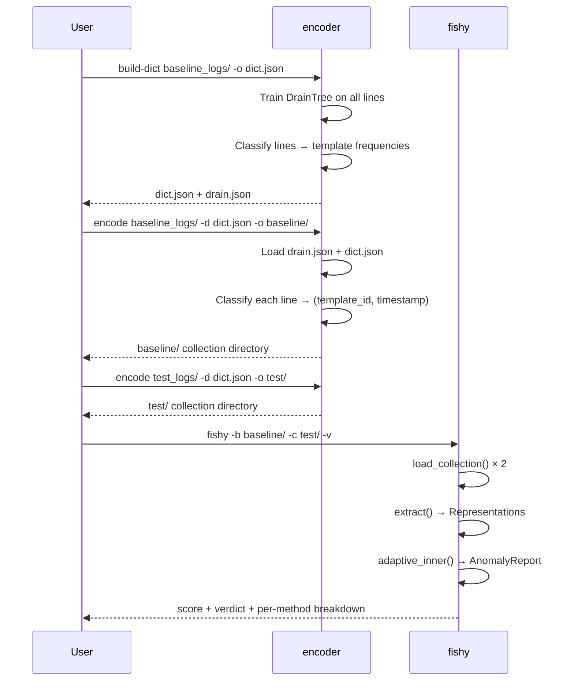
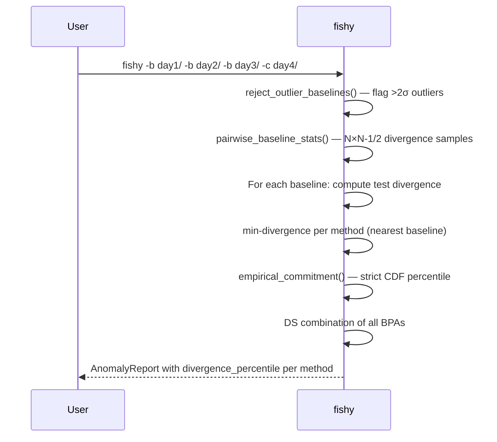
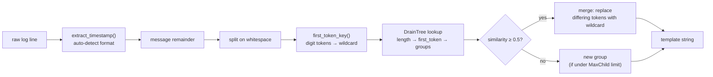
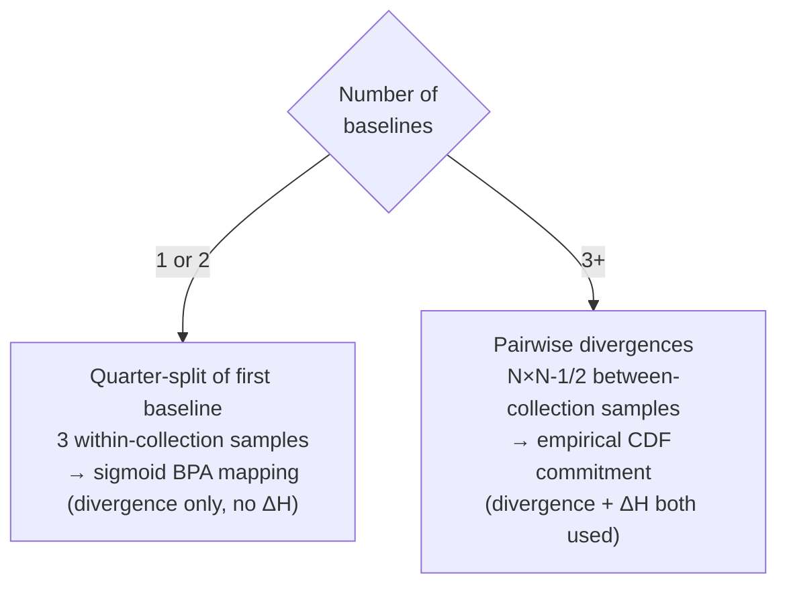
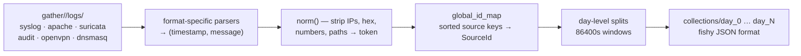

# Workflows — fishy

## End-to-end: raw logs → anomaly score

## Multi-baseline workflow (recommended)

## Encoder: Drain template extraction

## Baseline variance estimation paths

The ΔH (entropy delta) signal is suppressed in the sigmoid fallback because within-collection entropy variance severely underestimates between-collection entropy variance, causing false positives.

## AIT-LDSv2 preprocessing (prep_ait.py)

